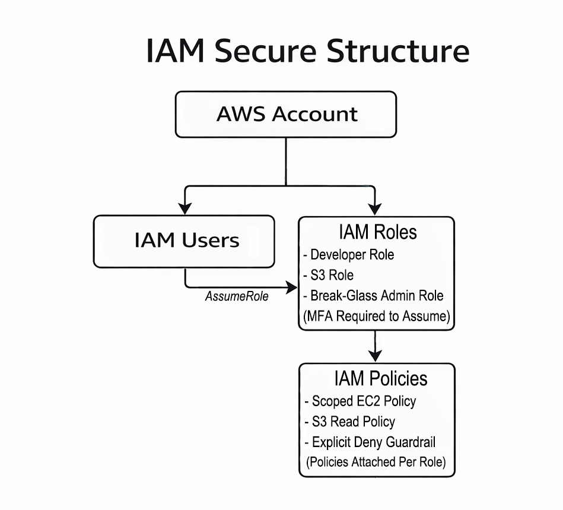

# AWS IAM Guardrails & Scoped Access (Terraform)

Production-style IAM design implemented using Terraform, demonstrating scoped permissions, explicit deny guardrails, and MFA-enforced administrative access.

---

## Overview

This project demonstrates advanced AWS Identity and Access Management (IAM) architecture using Infrastructure as Code.

It models realistic security controls by implementing:

- Role-based access control
- Resource-level permission scoping (no wildcard resource usage)
- Explicit deny guardrail policies
- MFA-enforced break-glass administrative access
- Real AWS resource scoping (EC2 + S3)
- Reproducible infrastructure managed with Terraform

The objective is to demonstrate practical IAM engineering patterns used to prevent privilege escalation and enforce least privilege at scale.

---

## Architecture Design



The following IAM roles are implemented:

### Developer Role
- Scoped EC2 instance control
- Allowed actions:
  - `ec2:DescribeInstances`
  - `ec2:StartInstances`
  - `ec2:StopInstances`
  - `ec2:RebootInstances`
- Permissions restricted to a specific EC2 instance ARN
- Guardrail deny policy attached

### S3 Reader Role
- Read-only access to a specific S3 bucket
- Allowed action:
  - `s3:GetObject`
- Scoped to bucket object ARN
- Guardrail deny policy attached

### Break-Glass Admin Role
- Full administrative access
- MFA required for role assumption
- Designed for controlled escalation or emergency use

---

## Security Controls Implemented

### 1. Resource-Level Scoping

No use of:
"Resource": "*"


Scoped ARNs are used for:
- A specific EC2 instance
- A specific S3 bucket and its objects

---

### 2. Explicit Deny Guardrails

A deny policy prevents high-risk IAM operations, including:

- IAM user creation
- Policy modification
- Privilege escalation actions

This demonstrates understanding of IAM evaluation logic:

> Explicit Deny overrides Allow.

---

### 3. MFA Enforcement

The break-glass administrative role enforces MFA using a condition block:

```json
{
  "Condition": {
    "Bool": {
      "aws:MultiFactorAuthPresent": "true"
    }
  }
}
```

This models real-world production security practices.

---

## Terraform Structure

```
aws-iam-guardrails-terraform/
├── versions.tf
├── provider.tf
├── variables.tf
├── locals.tf
├── main.tf
```

All IAM roles, policies, and resource definitions are managed declaratively using Terraform.

---

## Key Concepts Demonstrated

- IAM policy document construction
- Scoped resource ARNs
- Role-based access control
- Explicit deny precedence
- Privilege escalation prevention
- MFA-based access control
- Terraform-managed IAM lifecycle

---

## Deployment

1. Configure AWS credentials.
2. Create a terraform.tfvars file:

```
region = "us-east-1"
```

3. Initialize Terraform:

```
terraform init
```

4. Review the execution plan:

```
terraform plan
```

5. Apply the configuration:

```
terraform apply
```

6. Destroy infrastructure when finished:

```
terraform destroy
```

---

## Design Intent

This repository models security-first IAM architecture rather than permissive access.

It demonstrates how to:
- Precisely limit resource access
- Prevent dangerous IAM modifications
- Enforce conditional administrative access
- Implement security guardrails using Infrastructure as Code

---

## Author

Sebastian Silva C. - Cloud Engineer – Secure Infrastructure & Automation - Berlin, Germany
